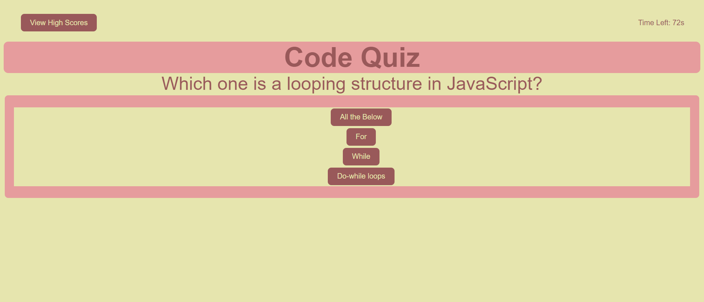

# Web APIs  

## Code Quiz - Module 4  

This is a quiz on JavaScript coding questions. 
The object of this project was to set and get data in the local storage webAPI. 
The user was to finish the quiz before the timer ran out. 
There is a 10 second penalty for wrong answers.  

Github Repo: https://github.com/tarajevans/code-quiz  

Deployed URL: https://tarajevans.github.io/code-quiz/  

  

User Story  

AS A coding boot camp student 
I WANT to take a timed quiz on JavaScript fundamentals that stores high scores 
SO THAT I can gauge my progress compared to my peers  

Acceptance Criteria  

GIVEN I am taking a code quiz 
WHEN I click the start button 
THEN a timer starts and I am presented with a question 
WHEN I answer a question 
THEN I am presented with another question 
WHEN I answer a question incorrectly 
THEN time is subtracted from the clock 
WHEN all questions are answered or the timer reaches 0 
THEN the game is over 
WHEN the game is over 
THEN I can save my initials and score
